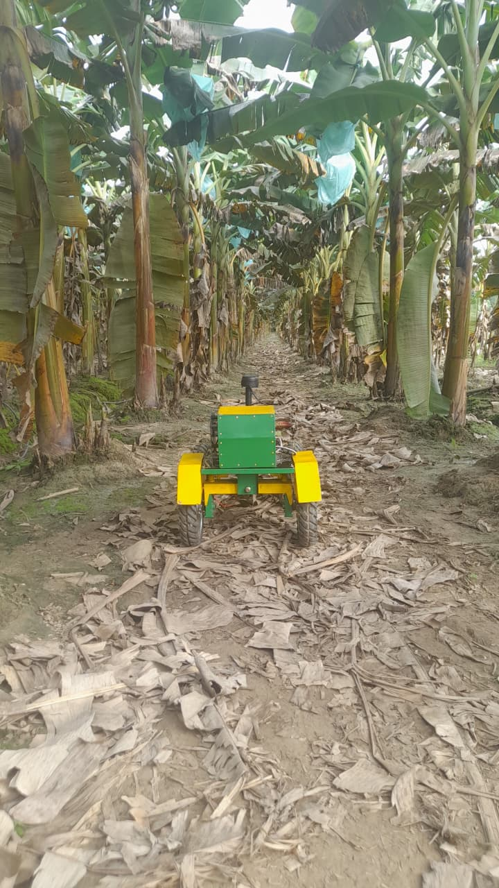
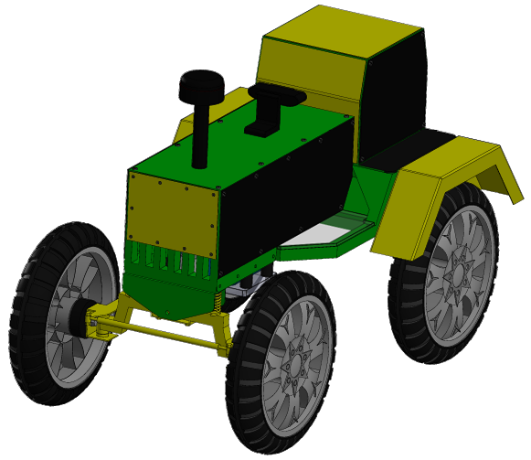
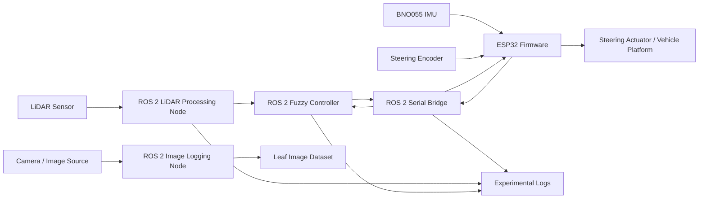
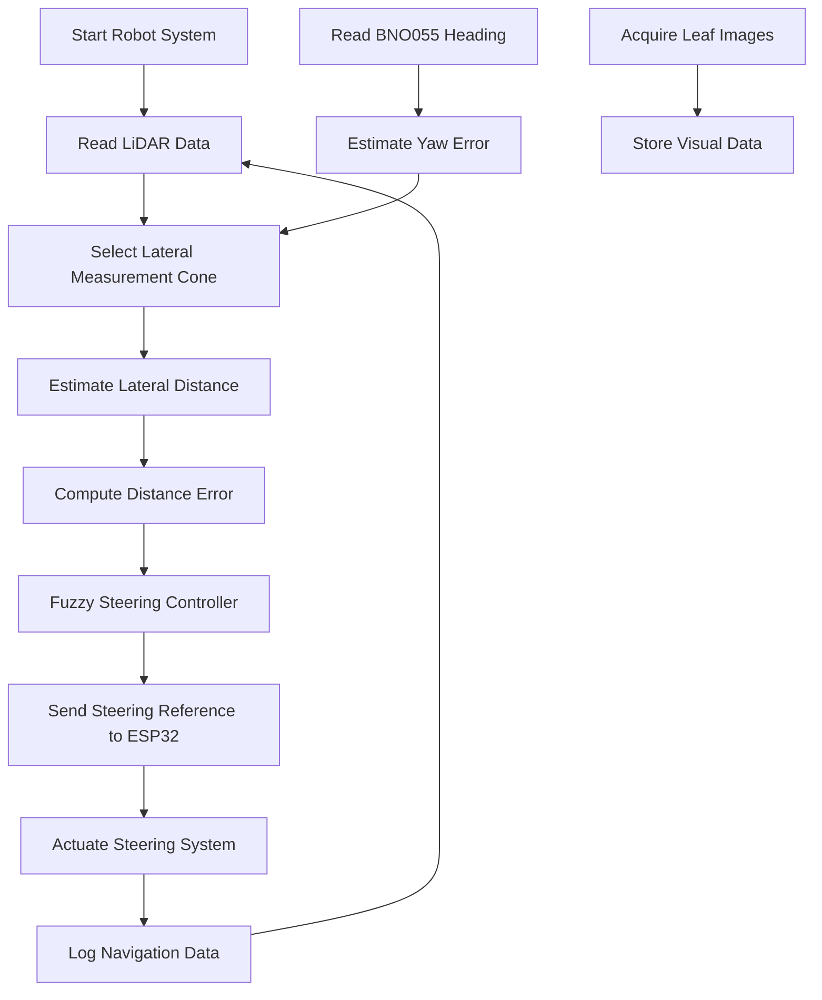
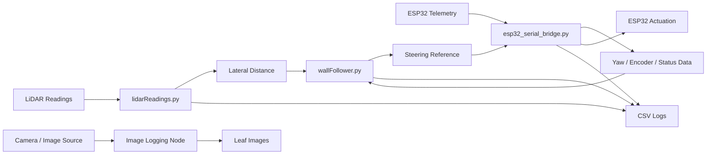

# Low-Cost Plantain Row-Following Robot

This repository documents a low-cost autonomous robotic platform for plantain crop row-following under canopy conditions.

The platform, informally known as **"El Chino de los Mandados"**, integrates an ESP32-based low-level controller, ROS 2 nodes for perception and decision-making, LiDAR-based lateral distance estimation, BNO055-assisted geometric yaw compensation, fuzzy steering control, and image acquisition for visual inspection of plantain leaves.

## Related Work and Collaboration

This repository documents work developed within my postdoctoral research stay on low-cost autonomous robotic systems for plantain crop environments.

The project was carried out under my academic and technical guidance, with the valuable collaboration of https://github.com/Celenaxz, who contributed to the organization and initial documentation of a related development repository.

Related collaborative repository:

- [Celenaxz/Robot-el-chino-de-los-mandados](https://github.com/Celenaxz/Robot-el-chino-de-los-mandados)

This curated repository reorganizes and expands the material from a research presentation perspective, improving readability, documentation, reproducibility, and connection with the associated manuscript.

## Research Context

The project addresses low-cost autonomous navigation for agricultural environments, with emphasis on plantain crop rows and under-canopy operation.

The system was designed to explore how affordable embedded hardware, LiDAR sensing, IMU-assisted geometric correction, ROS 2-based processing, fuzzy control, and image acquisition can be integrated into a field-oriented robotic platform.

The main research goals are:

- to develop a low-cost robotic platform for crop-row navigation,
- to estimate lateral distance using LiDAR measurements,
- to compensate the LiDAR measurement cone using IMU-based yaw information,
- to generate steering references using a fuzzy controller,
- to acquire visual data from plantain leaves for offline inspection and future computer-vision-based analysis,
- to log experimental data for analysis and reproducibility,
- to support agricultural robotics research with open and understandable documentation.

The robot is not only a row-following platform; it also supports visual data acquisition from plantain leaves, enabling future integration with computer-vision-based crop monitoring approaches.

## Visual Overview

### Robotic Platform



<p align="center">
  
</p>

### Demonstration Video

[](https://www.youtube.com/watch?v=eixFaqiUshI)

This video presents robotic prototypes developed as part of my postdoctoral research work on low-cost autonomous robots for agricultural environments.

## System Architecture



## Functional Overview

The robot follows plantain crop rows using a combination of LiDAR-based lateral distance estimation and fuzzy steering control.

The BNO055 IMU is used as a geometric auxiliary to orient or correct the LiDAR measurement cone. It is not used as part of a vehicle stabilization control loop.

The visual subsystem is used to acquire and document plantain leaf images during field-oriented experiments. In the current architecture, this visual component supports inspection, documentation, and future computer-vision-based analysis, but it is not the main feedback signal for robot navigation.



## Repository Structure

```text
firmware/
└── esp32/                  ESP32 PlatformIO firmware

ros2_ws/
└── hinf/                   ROS 2 package and nodes

data/
└── experimental_trials/    Experimental CSV logs

figures/
└── experimental_results/   Plots and figures related to experiments

media/
└── images/                 Robot images and visual material

docs/                       Technical documentation
```

## Main Components

### ESP32 Low-Level Controller

The ESP32 is used as the low-level embedded controller.

Main tasks:

- steering encoder reading,
- BNO055 IMU acquisition,
- serial communication with the onboard computer,
- reception of steering references,
- telemetry transmission,
- low-level actuator command handling.

Location:

```text
firmware/esp32/
```

### ROS 2 Processing Layer

The ROS 2 package contains the high-level processing nodes used for communication, perception, control, image acquisition, and logging.

Main components:

- ESP32 serial bridge,
- LiDAR processing,
- lateral distance estimation,
- yaw-compensated LiDAR cone selection,
- fuzzy steering controller,
- image or snapshot logging,
- experimental data acquisition.

Location:

```text
ros2_ws/hinf/
```

### Image Acquisition and Visual Inspection

The system also includes image acquisition for documenting plantain leaves during robot experiments.

This visual component is intended to support:

- image logging during field-oriented tests,
- documentation of plantain leaf conditions,
- offline inspection of visual traits,
- future computer-vision-based analysis related to crop monitoring.

In the current architecture, the visual component is treated as an inspection and documentation module, not as the main feedback signal for robot navigation.

### LiDAR-Based Lateral Distance Estimation

The LiDAR sensor is used to estimate the lateral distance between the robot and the crop-row structure or lateral reference.

The system processes a selected angular sector of LiDAR readings, which can be geometrically adjusted using yaw information from the BNO055 IMU.

### BNO055 IMU Usage

The BNO055 IMU provides orientation information used to support the interpretation of the LiDAR measurements.

Important note:

> The IMU is used as a geometric auxiliary to orient or correct the LiDAR measurement cone. It is not used as part of a vehicle stabilization control loop.

This distinction is important for understanding the system architecture and the role of each sensor.

### Fuzzy Steering Controller

A fuzzy controller generates steering references based on lateral navigation information.

The fuzzy control approach was selected because it is:

- interpretable,
- suitable for low-cost prototypes,
- useful for reactive navigation,
- experimentally adjustable,
- appropriate for early-stage agricultural robotics platforms.

## Software Data Flow



## Experimental Data

Experimental logs are stored in:

```text
data/experimental_trials/
```

These files may include:

- lateral distance measurements,
- distance error,
- IMU heading,
- yaw error,
- valid LiDAR beams,
- desired steering references,
- steering response,
- angular velocity measurements,
- time-stamped experimental data.

The dataset folders include selected trials used during experimental validation and manuscript preparation.

## Visual Data

The visual component of the system supports the acquisition and organization of plantain leaf images.

These images may be used for:

- visual inspection,
- documentation of crop conditions,
- future computer-vision-based classification,
- complementary analysis of field experiments.

The image acquisition component is complementary to the navigation system. It does not replace the LiDAR-based lateral distance estimation used for row-following.

## Experimental Variables

The experimental logs may contain variables related to:

| Variable / Signal | Description |
|---|---|
| LiDAR lateral distance | Estimated distance from the robot to the lateral crop-row reference |
| Distance error | Difference between desired and measured lateral distance |
| IMU heading | Orientation information provided by the BNO055 |
| Yaw error | Geometric correction variable used to orient the LiDAR measurement cone |
| Valid beams | Number or distribution of valid LiDAR readings in selected sectors |
| Steering reference | Desired steering command generated by the fuzzy controller |
| Steering response | Measured or estimated response of the steering mechanism |
| Leaf images | Visual information acquired for offline inspection and future computer-vision analysis |
| Time | Sampling or logging time associated with each measurement |

## Figures and Media

Figures and visual material are organized under:

```text
figures/
media/
```

These folders may include:

- experimental plots,
- robot photographs,
- system diagrams,
- field or laboratory images,
- manuscript-related figures,
- visual material related to leaf image acquisition.

## Suggested Figure Set for the Manuscript

The following figures can be prepared from this repository and the associated experimental material:

1. **Robot platform overview**  
   General photograph of the robot and its main hardware components.

2. **System architecture diagram**  
   ESP32, LiDAR, BNO055, ROS 2 nodes, fuzzy controller, image acquisition, and logging system.

3. **LiDAR measurement cone diagram**  
   Illustration of the lateral measurement sector and the yaw-based geometric correction.

4. **ROS 2 software flow diagram**  
   Data flow between `lidarReadings.py`, `esp32_serial_bridge.py`, `wallFollower.py`, image logging modules, and data logging components.

5. **Experimental lateral distance response**  
   Plot of lateral distance and distance error during row-following experiments.

6. **Valid LiDAR readings**  
   Plots showing valid beams in selected LiDAR sectors.

7. **Steering reference and response**  
   Desired steering command and measured response during experimental trials.

8. **IMU heading and yaw error**  
   Orientation-related variables used to support LiDAR cone correction.

9. **Leaf image acquisition examples**  
   Representative images acquired during field-oriented experiments for visual inspection and future computer-vision analysis.

## Relationship with the Manuscript

This repository provides supplementary material for a manuscript currently under review focused on low-cost autonomous navigation in plantain crop environments.

The repository supports the manuscript by providing:

- firmware structure,
- ROS 2 processing code,
- experimental logs,
- figures and plots,
- visual documentation,
- image acquisition material,
- reproducibility notes,
- traceability to the original student repository.

Once the manuscript is published or formally available online, the complete citation, DOI, and publication link will be added to this repository.

## Collaboration and Attribution

This repository is based on research work developed during my postdoctoral stay on low-cost autonomous robotic systems for plantain crop environments.

The project benefited from the valuable collaboration of student Danna Montenegro, who contributed to the organization and initial documentation of a related repository under my academic and technical guidance.

Related collaborative repository:

- [Celenaxz/Robot-el-chino-de-los-mandados](https://github.com/Celenaxz/Robot-el-chino-de-los-mandados)

This repository reorganizes and expands the material from a research presentation perspective, while preserving traceability to the collaborative development work.

## Technologies

- ROS 2
- ESP32
- PlatformIO
- Python
- C / C++
- LiDAR
- BNO055 IMU
- Fuzzy control
- Image acquisition
- Computer vision support
- Leaf image inspection
- Embedded systems
- Agricultural robotics
- Experimental data logging

## Reproducibility Notes

This repository is under active organization and documentation.

Some files, names, and structures may be preserved to maintain traceability with the original development repository, experimental work, and manuscript preparation.

The repository is intended to support academic discussion, research reproducibility, and future development of low-cost agricultural robotic platforms.

## Status

This repository is being prepared as supplementary research content for a manuscript on low-cost autonomous navigation in plantain crop environments.

Current status:

- ESP32 firmware included.
- ROS 2 package included.
- Experimental data included.
- Image acquisition and visual inspection material included or under organization.
- Figures and media under organization.
- Documentation under active improvement.
- Associated manuscript currently under review.

Once the manuscript is published or formally available online, the complete citation and DOI will be added.

## Author

Henry B. Guerrero  
Universidad Distrital Francisco José de Caldas  
GitHub: [HBG2025](https://github.com/HBG2025)  
ORCID: [0000-0003-4243-4205](https://orcid.org/0000-0003-4243-4205)