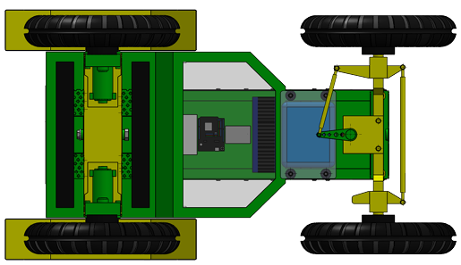

# Low-Cost Plantain Row-Following Robot

This repository documents a low-cost autonomous robotic platform for plantain crop row-following under canopy conditions.

The platform, informally known as **"El Chino de los Mandados"**, integrates an ESP32-based low-level controller, ROS 2 nodes for perception and decision-making, LiDAR-based lateral distance estimation, BNO055-assisted geometric yaw compensation, and a fuzzy controller for steering commands.

## Related Work

This repository is associated with an ongoing manuscript on low-cost autonomous navigation in plantain crop environments.

Original student repository:

- [Celenaxz/Robot-el-chino-de-los-mandados](https://github.com/Celenaxz/Robot-el-chino-de-los-mandados)

This curated repository reorganizes the material to improve readability, documentation, reproducibility, and research presentation.

## Research Context

The project addresses low-cost autonomous navigation for agricultural environments, with emphasis on plantain crop rows and under-canopy operation.

The system was designed to explore how affordable embedded hardware, LiDAR sensing, IMU-assisted geometric correction, and ROS 2-based processing can be integrated into a field-oriented robotic platform.

The main research goals are:

- to develop a low-cost robotic platform for crop-row navigation,
- to estimate lateral distance using LiDAR measurements,
- to compensate the LiDAR measurement cone using IMU-based yaw information,
- to generate steering references using a fuzzy controller,
- to log experimental data for analysis and reproducibility,
- to support agricultural robotics research with open and understandable documentation.

## Visual Overview

### Robotic Platform


### System Diagrams

<p align="center">
  
  
</p>

### Demonstration Video

[](https://www.youtube.com/watch?v=eixFaqiUshI)

This video presents robotic prototypes developed as part of my postdoctoral research work on low-cost autonomous robots for agricultural environments.

## System Architecture

```mermaid
flowchart LR
    A[LiDAR Sensor] --> B[ROS 2 LiDAR Processing Node]
    C[BNO055 IMU] --> D[ESP32 Firmware]
    E[Steering Encoder] --> D
    D --> F[ROS 2 Serial Bridge]
    F --> G[ROS 2 Fuzzy Controller]
    B --> G
    G --> F
    F --> D
    D --> H[Steering Actuator / Vehicle Platform]
    F --> I[Experimental Logs]
    B --> I
    G --> I